# Cosmic Whisper

  

## Introduction
_Cosmic Whisper_ is an interactive educational game developed to inspire interest in optics and electrical engineering through immersive and hands-on problem solving. Designed under Professor Saharnaz's supervise at UC San Diego, the game simulates a mission in which players act as scientists attempting to communicate with an alien civilization orbiting a chaotic three-star system, drawing inspiration from _The Three-Body Problem_. Packaged in a durable stainless steel housing and driven by an ESP32-S3 microcontroller, the game challenges players through a multi‑stage puzzle sequence that blends hands‑on experiments with digital logic.

Players must solve a series of challenges involving light transmission and absorption, spectroscopy, optical ciphers (Morse code and Vigenère), and light intensity modulation. These tasks introduce foundational physics and engineering concepts in a dynamic and exploratory format. The final stage expands the game’s interactivity through real-time audio and light processing. It includes digital frequency detection using a microphone and FFT on an ESP32-S3 to map sound frequency to LED colors and a digital envelope follower to control LED brightness based on sound amplitude. These elements demonstrate signal processing, circuit design, and optoelectronic feedback in an accessible way.

Cosmic Whisper will be showcased at outreach events to engage K-12 and general audiences, making complex scientific principles more visible and exciting. Through playful experimentation, the project promotes STEM learning and demonstrates the creative intersection of science, engineering, and game design.

  

## Materials Used
The game is built using a combination of **3D-printed components**, **optics materials**, and **electronic hardware**, including:
- **Optical Components:** Diffraction grating slide, flashlight, UV light, mirrors
- **Electronics & Sensors:** FREENOVE ESP32-S3 WROOM, 3x4 matrix array keypad, I2C LCD 1602 Module (5V), linear actuator, BTS7960 Half-Bridge Motor Driver, LEDs, 4 pin switch button, RGB LED, MAX4466 electret microphone amplifier, TCS34725 RGB color sensor, 5V and 12V power supply, silicone wires, protoboard, pin headers
- **Miscellaneous:** Food dyes, fluorescent powders, glass/plastic containers, M5 screws/nuts/washers

## Game Logistics
Players must solve a series of **three interconnected puzzles** to complete their mission:

1. **Spectroscopy Challenge:** Identify the correct substances among a set of samples using a spectrometer and UV light. The correct substances reveal a password and keyword, allowing access to the next stage.
2. **Morse Code Decryption:** Observe the blinking LED sequences and decode the Morse code, decipher the Vigenère cipher to unlock the second password.
3. **Signal Transmission Puzzle:** Align the signal tower (a laser pointer mounted on a servo motor) to the sun using the control panel, setting the correct coordinates. When the LED strips light up, it confirms the signal has been successfully transmitted, completing the game.

## Substances Chart
| Set | Question | Choices | Correct Answer | Reasoning |
|----------|----------|:----------|:----------:|----------|
| **Food Dyes 1** | Which substance is missing wavelengths **Blue & Green** on the spectrum? | ➀ Fruit Green ➁ Sunset Yellow ➂ Lemon Yellow | **➁ Sunset Yellow** | Not obvious due to similar colors.|
| **Food Dyes 2** | Which substance has the **most wavelengths** on the spectrum? | ➃ Sunset Red ➄ Royal Blue ➅ Grape Violet | **➅ Grape Violet** | Unexpected due to its dark color. |
| **Food Dyes 3** | Which substance has the wavelength **Violet** on the spectrum? | ➆ Super Red ➇ Deep Pink ➈ Chocolate Brown | **➇ Deep Pink** | Not expected to be known. |
| **Fluorescent Powder** | Which substance glows **Light Blue** under UV light? | ⓵ Sky Blue ⓶ Blue Green ⓷ Olivine | **⓵ Sky Blue** | Identical under daylight. |

**Substances set up:** For food dyes, 1-1.5 drops each, into 50 mL vials.

## Understanding Spectroscopy and Food Dye Absorption
### How the Spectrometer Works
A spectrometer is an optical instrument that analyzes the composition of light by breaking it down into its **wavelength components**. It works by:
1. Passing light through a sample (in this case, food dye solutions).
2. Using a diffraction grating or prism to separate the light into its spectrum.
3. Detecting the intensity of each wavelength and plotting it as a graph.

When light shines through a **colored liquid**, certain wavelengths are **absorbed** by the substance while others **pass through** or are **transmitted**. The spectrometer captures these patterns, producing a **spectral absorption graph**, like the ones in the images below.

  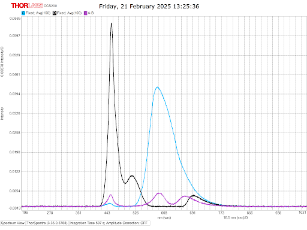

  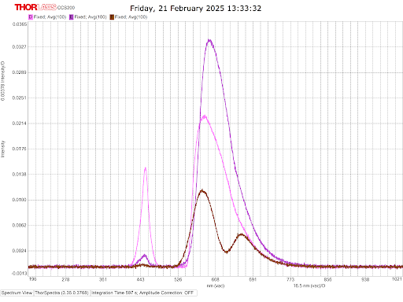

### Interpreting the Spectral Plots
Each plot shows **intensity vs. wavelength**, revealing which colors of light are absorbed or transmitted:
- Sharp peaks indicate **high transmission** (less absorption) of that wavelength
- Dips or missing wavelengths correspond to **absorption**, meaning the dye absorbs those colors from the light

For example, in the above graphs: 
- The first graph (Set 2) has a strong peak in the **blue/violet region** (~450 nm), suggesting that one of the substances absorbs less blue light and transmits it more
- The second graph (Set 3) has broader peaks in the **red** and **yellow regions** (~600–650 nm), yet only one has a peak at **blue/violet region** (~450 nm), suggesting that only one substance shows obvious **blue/violet** on the spectrum

By analyzing these spectra visually using the spectrometer, players in the game can determine **which substances contain specific wavelengths** and use that information to unlock the puzzle answers.

## Components Designed
### Spectrometer

  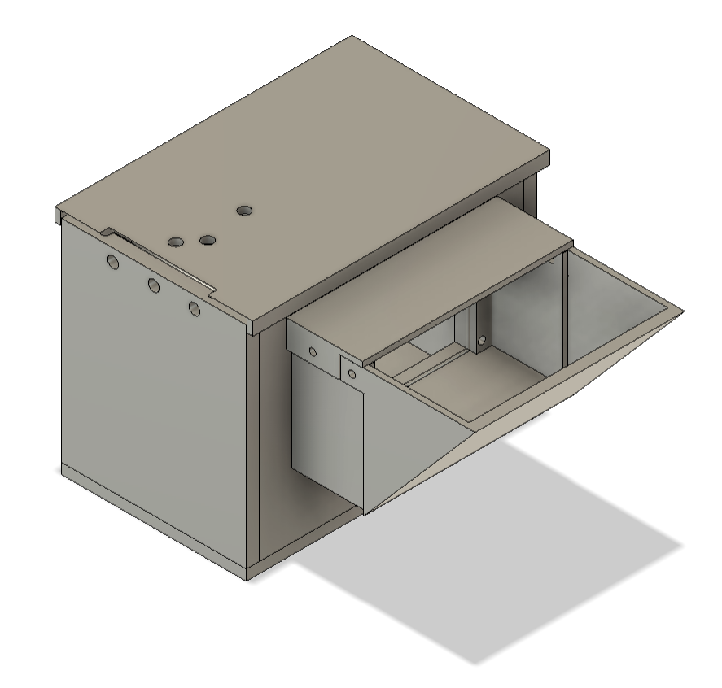
  &nbsp;&nbsp;&nbsp;&nbsp;&nbsp;
  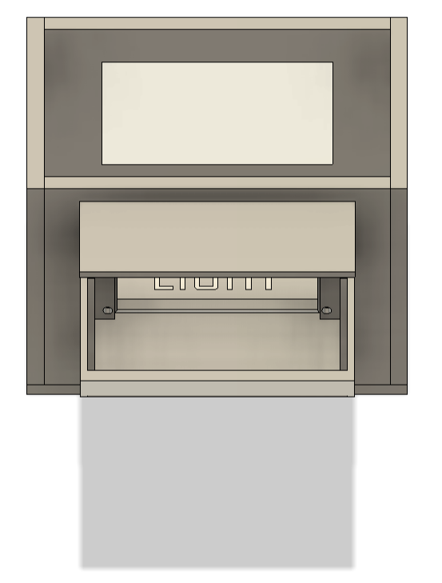

### Samples Holders

  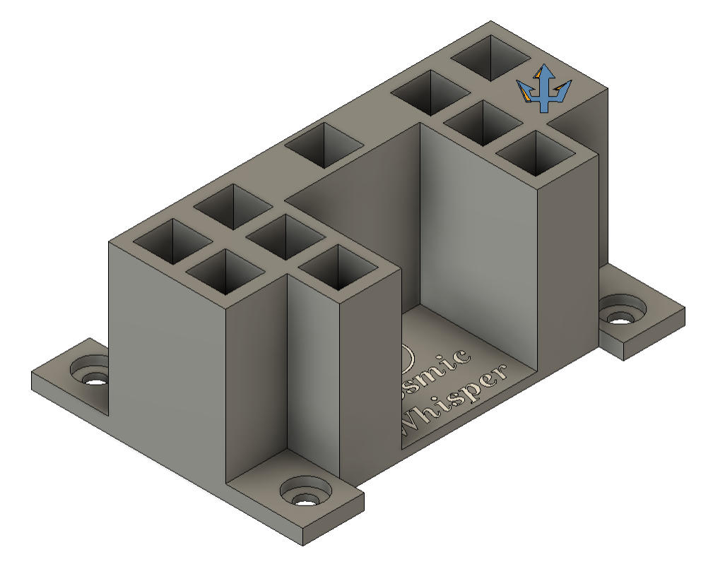

  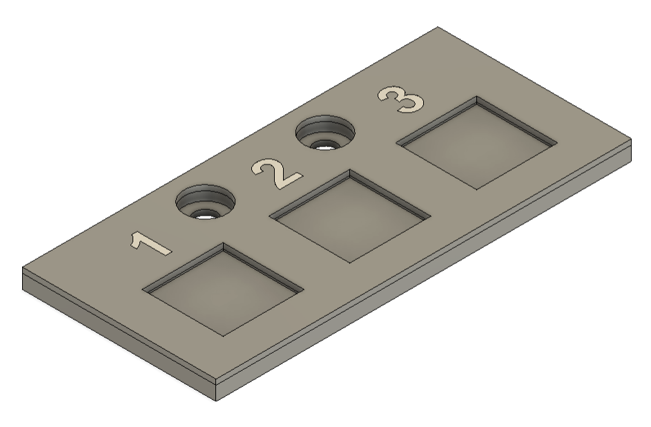
  &nbsp;&nbsp;&nbsp;&nbsp;&nbsp;
  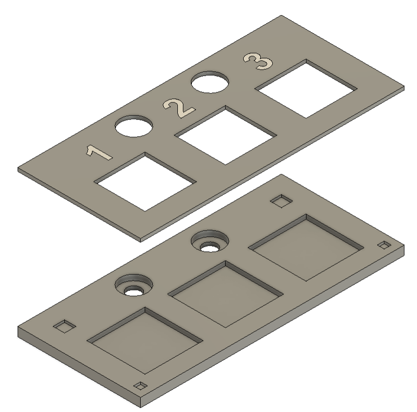

### Linear Actuator Mount

  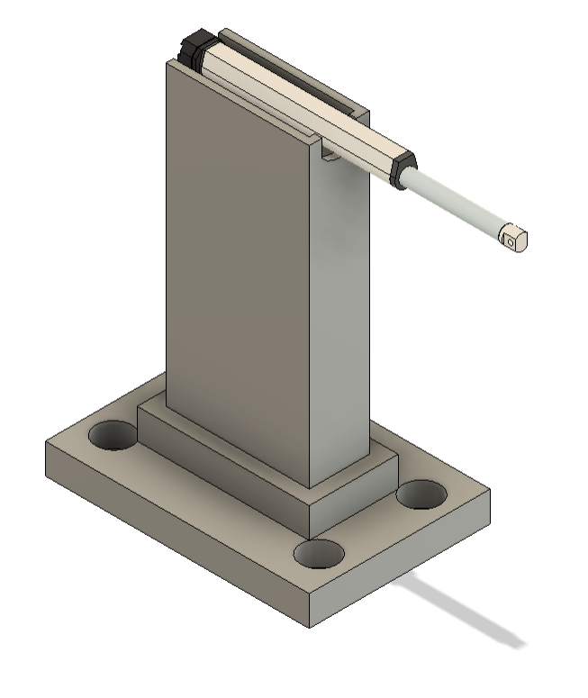

### Center Console

  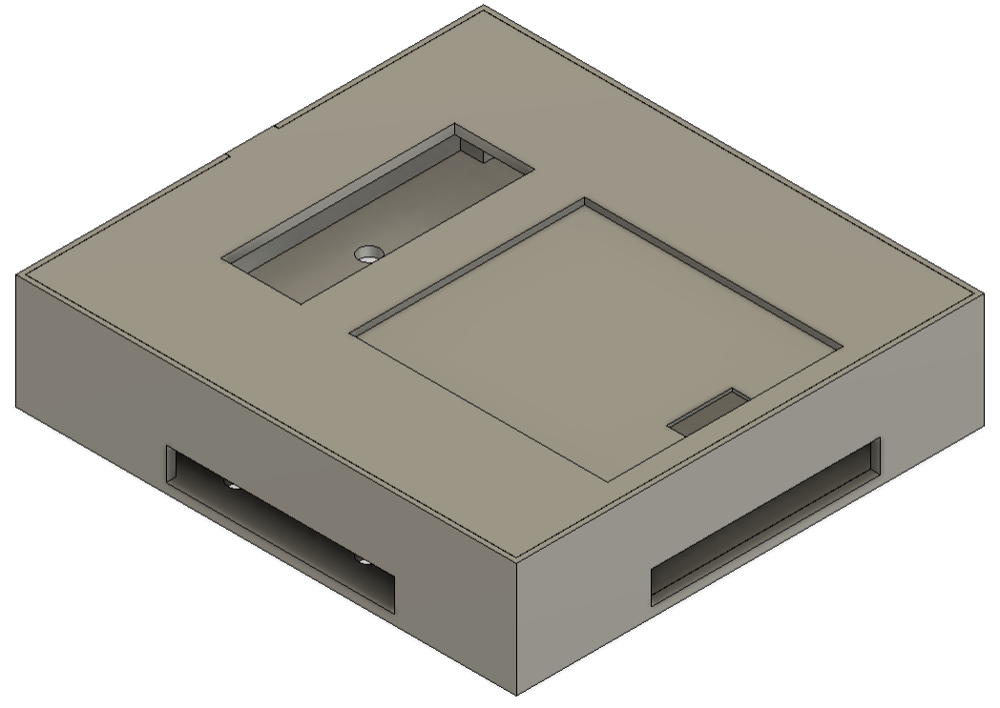
  &nbsp;&nbsp;&nbsp;&nbsp;&nbsp;
  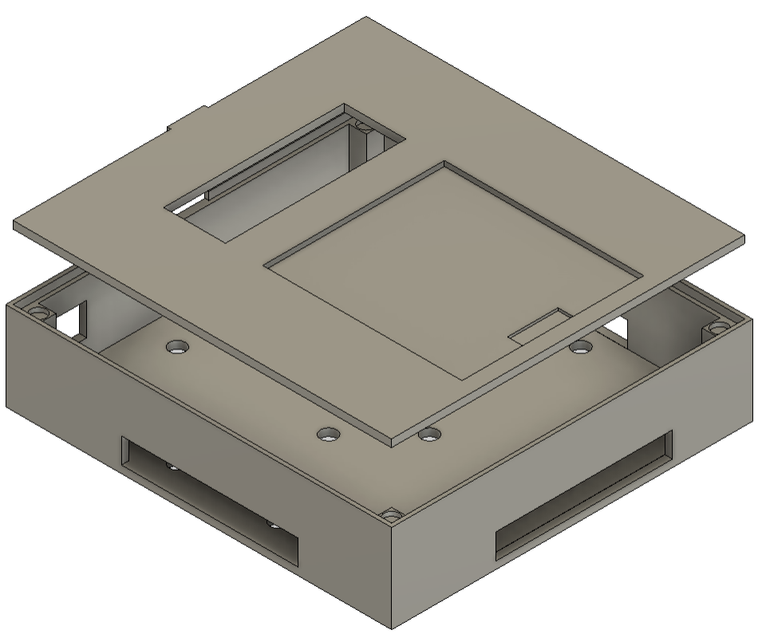

### Morse Code Case

  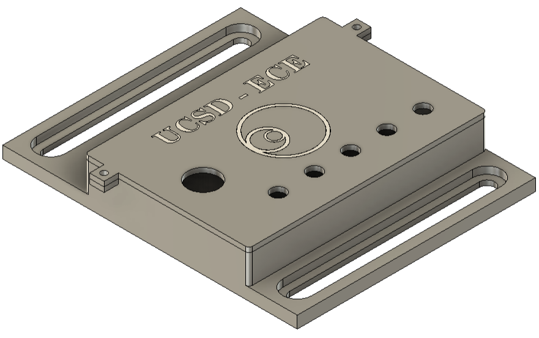

### Sensors Case

  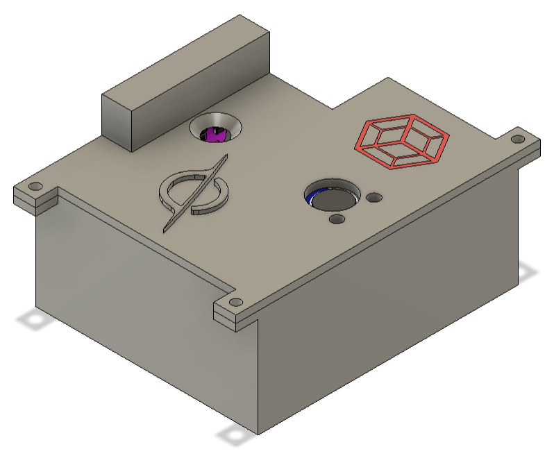
  &nbsp;&nbsp;&nbsp;&nbsp;&nbsp;
  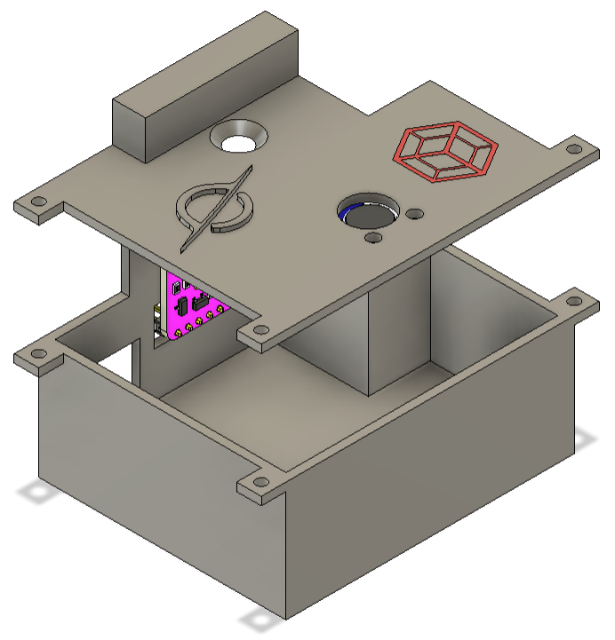

### SAE 304 Stainless Steel Board

  

### Board Supports

  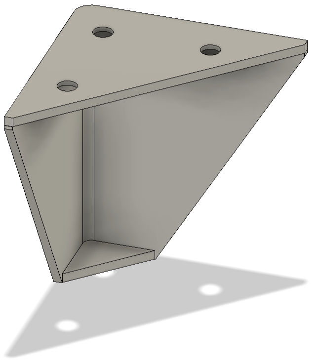
  &nbsp;&nbsp;&nbsp;&nbsp;&nbsp;
  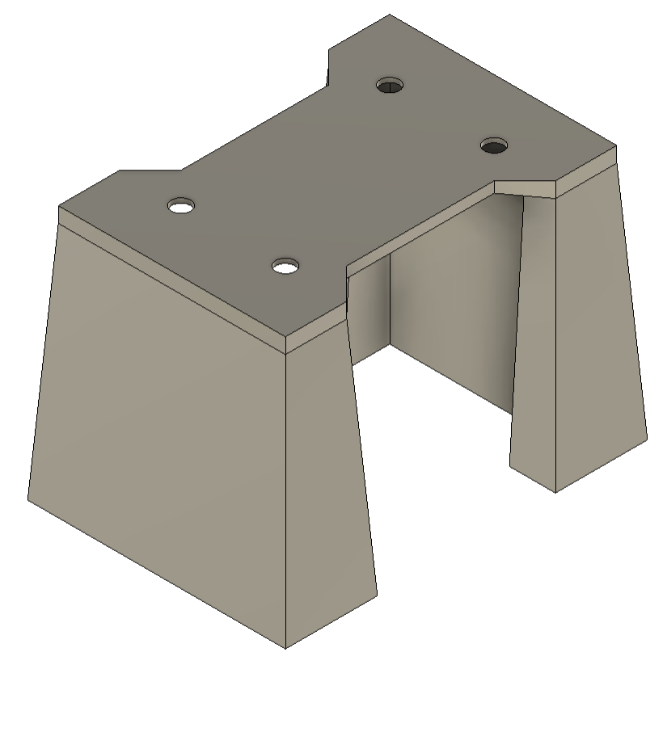

## Schematic

  

## Technical Skills & Tools Used
### Embedded Firmware & Microcontroller
Arduino/C++ development on ESP32-S3 with PSRAM, managing game flow, sensor integration (RGB sensor, microphone), FFT audio analysis, and actuator control.

### Optics & Spectroscopy
Design and prototyping of a custom spectrometer, calibration with food dye samples, and fluorescence assays with UV excitation.

### Mechanical Design & Fabrication
Laser‑cutting SAE 304 stainless steel mounting board, engraving project and author details, and 3D‑printing custom supports, and purchasing ergonomic handles.

### Electrical Design & Soldering
Schematic capture in KiCAD, component placement planning, and precision soldering using pre‑crimped silicone cables, pins, and sockets for modular assembly.

### Signal Processing & Cryptography
Real‑time FFT for frequency detection, amplitude modulation, Morse code LED signaling, and Vigenère cipher implementation with ASCII mapping.

#### Networking & Cloud Integration
Wi-Fi connectivity with ESP32-S3 in STA mode, HTTP-based communication with Google Sheets via Apps Script, real-time game state synchronization using web service requests for both data logging and remote game progression.

### Software Tools & Version Control
GitHub for source control and documentation, KiCAD for PCB/schematic design, and Fusion 360 for 3D part modeling.

### Prototyping & Testing
Iterative component optimization, end‑to‑end functional testing, and calibration under varied lighting and audio conditions.

## Acknowledgments
✨ Thanks for checking out **Cosmic Whisper**!

Special thanks to **Professor Saharnaz** for the mentorship and **ECE Makerspace** for the fabrication & resource supports!

Feel free to replicate or build upon this project, just make sure to give credit as outlined in the [MIT License](LICENSE) 😊.
